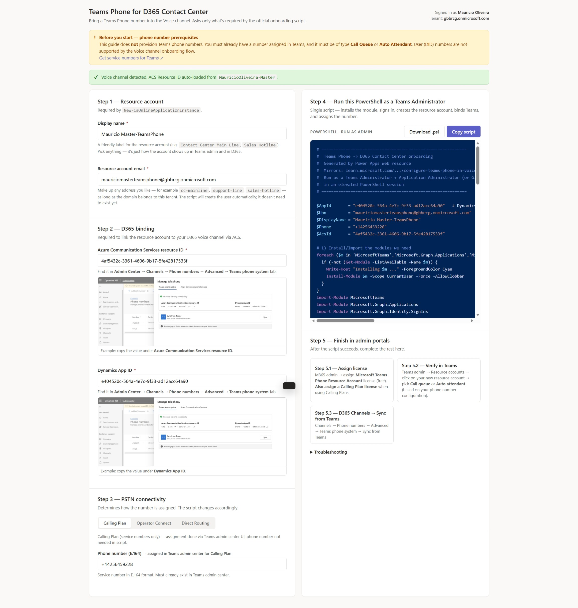

# Teams Phone for D365 Contact Center — Self-Serve Wizard

A Dataverse web resource that walks an admin through bringing a **Teams Phone** number into the **Dynamics 365 Contact Center Voice channel** with the minimum number of clicks. It auto-detects the Voice channel, asks only for the values the official onboarding script actually requires, and emits a tailored PowerShell that any Teams admin can paste into a session.



---

## What it does

- **Auto-detects the Voice channel** in the current Dataverse environment and pre-fills the ACS Immutable Resource ID.
- **Auto-detects the tenant** (no hardcoded GUIDs / domains) and pre-fills the resource account UPN.
- **Self-provisions an Entra app** for the D365 → Teams sync (creates `D365 Contact Center - Teams Phone Sync` with `TeamsResourceAccount.Read.All` and grants tenant-wide admin consent) — the admin only supplies the App ID after the first run.
- **Emits a single PowerShell script** that installs MicrosoftTeams, signs in, creates the resource account, binds Teams, and assigns the number.
- **Deep-links** to the right pages in Teams Admin Center, M365 Admin Center, and the D365 Customer Service workspace for each step.
- **Ships as a Dataverse solution** so it can be exported once and installed in any tenant.

## Prerequisites

> ⚠️ This guide does **not** provision Teams phone numbers. You must already have a number assigned in Teams, and it must be of type **Call Queue** or **Auto Attendant**. User (DID) numbers are not supported by the Voice channel onboarding flow. — see [Get service numbers for Teams](https://learn.microsoft.com/microsoftteams/getting-service-phone-numbers).

You also need:

- A Dataverse environment with the **Customer Service / Contact Center** app and the **Voice channel** provisioned (ACS resource attached).
- Teams Administrator + Global Administrator in the target tenant.
- A Microsoft Teams Phone Resource Account license (free SKU is fine).
- Local PowerShell 5.1+ with permission to install the `MicrosoftTeams` and `Microsoft.Graph` modules.
- [Power Platform CLI (`pac`)](https://learn.microsoft.com/power-platform/developer/cli/introduction) only if you want to import the solution from the command line.

## Repo layout

```
webresource/
  mau_TeamsPhoneSetup.html        # the actual wizard (HTML web resource)
  mau_teamsphone_example.png      # screenshot used inside the wizard

dist/
  mauTeamsPhoneSetup_1_0_0_0.zip          # unmanaged solution
  mauTeamsPhoneSetup_1_0_0_0_managed.zip  # managed solution (recommended for installs)

docs/
  screenshot.jpeg                 # README screenshot

upload.ps1            # publishes the HTML + PNG web resources to a Dataverse env
create-solution.ps1   # creates/refreshes the Dataverse solution and exports the zips
```

## Install in your tenant

### Option A — import the managed solution (recommended)

1. Download [`dist/mauTeamsPhoneSetup_1_0_0_0_managed.zip`](dist/mauTeamsPhoneSetup_1_0_0_0_managed.zip).
2. Open [Power Apps maker portal](https://make.powerapps.com) → pick your environment → **Solutions** → **Import solution** → upload the zip.
3. Open the wizard at:
   `https://<your-org>.crm.dynamics.com/WebResources/mau_TeamsPhoneSetup.html`

### Option B — install with `pac`

```powershell
pac auth create --environment https://<your-org>.crm.dynamics.com
pac solution import --path .\dist\mauTeamsPhoneSetup_1_0_0_0_managed.zip
```

### Option C — publish from source (for contributors)

```powershell
# publish the HTML + PNG as web resources
.\upload.ps1 -OrgUrl https://<your-org>.crm.dynamics.com

# wrap them in a Dataverse solution and export new zips into ./dist
.\create-solution.ps1 -OrgUrl https://<your-org>.crm.dynamics.com -Export
```

Both scripts use `az account get-access-token` for auth (run `az login` first) and accept `-OrgUrl` / `$env:DATAVERSE_URL`. Nothing in either script is hardcoded to a specific tenant, publisher, or solution name — every value is overridable.

## How the wizard works

1. **Enter values** — the wizard pre-fills everything it can. The admin types a friendly display name; everything else (UPN, ACS ID, tenant) is auto-detected.
2. **Run PowerShell** — the wizard generates a fully-tailored script with **Copy script** and **Download .ps1** buttons. The script self-provisions the sync Entra app on first run, creates the Teams resource account, binds the Teams policies, and assigns the phone number.
3. **Assign license** — deep link to M365 Admin Center for the Teams Phone Resource Account license.
4. **Sync from Teams in D365** — deep link to **Customer Service workspace → Admin Center → Channels → Phone numbers → Advanced → Teams phone system**.
5. **Attach to workstream** — deep link to the workstream / queue editor.

## Troubleshooting

- The generated PowerShell prints any Graph / Teams error verbatim. Most failures are missing licenses or RBAC on the runner identity.
- For the underlying onboarding flow Microsoft documents, see:
  - [Configure Teams Phone in voice channel](https://learn.microsoft.com/dynamics365/contact-center/administer/configure-teams-phone-in-voice-channel)
  - [Microsoft sample onboarding script](https://github.com/microsoft/Dynamics365-Apps-Samples/blob/master/contact-center/TeamsPhoneSystem-TeamsAdminCenterOnboardScript.ps1)

## License

MIT.
